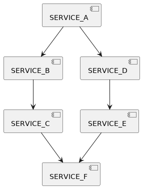
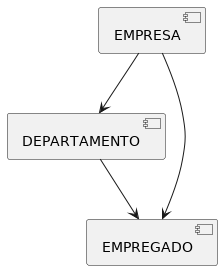

## Distributed Log Tracing using Sleuth and Zipkin

A arquitetura de microsserviços envolve vários serviços que interagem entre si. Portanto, uma funcionalidade pode envolver chamadas para vários microsserviços. Normalmente, para sistemas desenvolvidos com arquitetura de microsserviços, existem muitos microsserviços envolvidos, isso ocorre muito em fluxos longos como as SAGAs por exemplo.

Imagine o cenário abaixo, onde muitiplas chamadas (seja Rest ou gRPC) acontecem entre os microsserviços envolvidos:

Suponha que durante essas chamadas haja algum problema ou ocorreu uma exceção, seja por haver problemas de latência devido a um determinado serviço demorando mais do que o esperado, como identificamos onde o problema está ocorrendo? Regularmente, teríamos usado o log para analisar e saber mais sobre as exceções ocorridas e também o tempo de desempenho, mas, como os microsserviços envolvem vários fluxos distintos, não podemos usar o log de apenas um, cada serviço terá seus próprios logs separados, portanto, precisaremos passar pelos logs de cada serviço, além disso, como correlacionamos os logs a uma cadeia de chamadas de solicitação? Ou seja, quais logs de microsserviços estão relacionados a Request1, quais estão relacionados a Request2?

Para resolver esses problemas, usamos Spring Cloud Sleuth e o Zipkin.

* O Spring Cloud Sleuth é usado para gerar e anexar o id de rastreamento, um "span id" aos logs para que eles possam ser usados por ferramentas como Zipkin, ELK (Elastick Search, Logstash e Kibana), Splunk, etc, dentre outras ferramentas do mercado para armazenamento e análise de logs.

* Zipkin é um sistema de rastreamento distribuído. Ele ajuda a coletar dados de tempo necessários para solucionar problemas de latência em arquiteturas de serviço. Os recursos incluem a coleta e a pesquisa desses dados.

**Vamos Começar**

Dividirei este tutorial em 3 partes:
1. Vamos criar três microsserviços que interajam entre si.

2. Implementar rastreamento distribuído usando Spring Cloud Sleuth.
3. Visualize o rastreamento distribuído usando o Zipkin.
