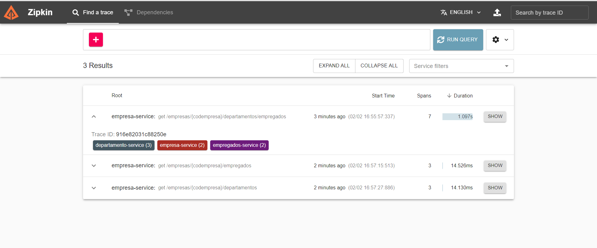
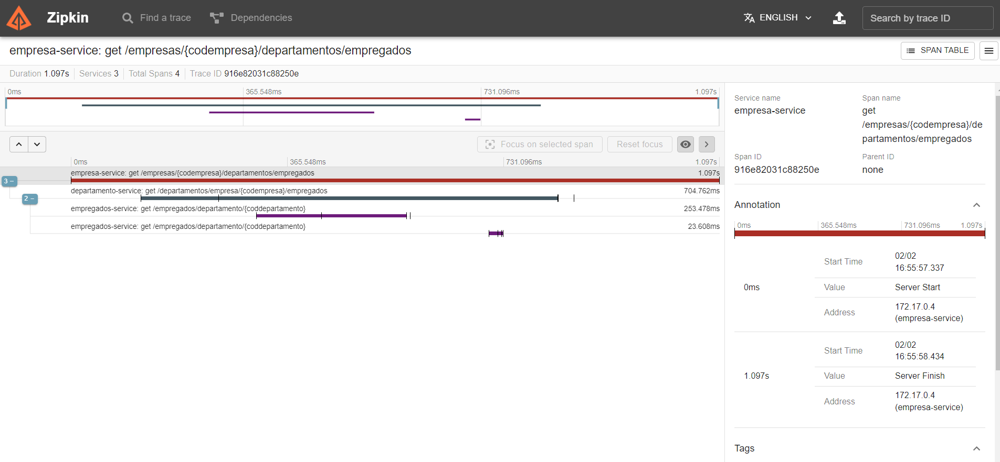

## Distributed Log Tracing using Sleuth and Zipkin

A arquitetura de microsserviços envolve vários serviços que interagem entre si. Portanto, uma funcionalidade pode envolver chamadas para vários microsserviços. Normalmente, isso ocorre muito em fluxos longos como as SAGAs por exemplo.

Imagine o cenário abaixo, onde multiplas chamadas (seja Rest ou gRPC) acontecem entre os microsserviços envolvidos:


Suponha que durante essas chamadas haja algum problema ou ocorreu uma exceção, seja por haver problemas de latência devido a um determinado serviço demorando mais do que o esperado, como identificamos onde o problema está ocorrendo? Regularmente, teríamos usado o log para analisar e saber mais sobre as exceções ocorridas e também o tempo de desempenho, mas, como os microsserviços envolvem vários fluxos distintos, não podemos usar o log de apenas um, cada serviço terá seus próprios logs separados, portanto, precisaremos passar pelos logs de cada serviço, além disso, como correlacionamos os logs a uma cadeia de chamadas de solicitação? Ou seja, quais logs de microsserviços estão relacionados a Request1, quais estão relacionados a Request2?

Para resolver esses problemas, usamos Spring Cloud Sleuth e o Zipkin.

* O Spring Cloud Sleuth é usado para gerar e anexar o id de rastreamento, um "span id" aos logs para que eles possam ser usados por ferramentas como Zipkin, ELK (Elastick Search, Logstash e Kibana), Splunk, etc, dentre outras ferramentas do mercado para armazenamento e análise de logs.

* Zipkin é um sistema de rastreamento distribuído. Ele ajuda a coletar dados de tempo necessários para solucionar problemas de latência em arquiteturas de serviço. Os recursos incluem a coleta e a pesquisa desses dados.

**Vamos Começar**

Dividirei este tutorial em 3 partes:
1. Vamos criar três microsserviços que interajam entre si.


2. Implementar rastreamento distribuído usando Spring Cloud Sleuth.
3. Visualizar o rastreamento distribuído usando o Zipkin.

## 1. Criando os projetos usando Spring Boot

Para configurarmos nossos três microsserviços iremos utilizar Spring Initializr para nos auxiliar nesta etapa.

1. Crie três microsserviços com os nomes: empresa-svc, departamento-svc e empregado-svc

2. Configure as propriedades do projeto conforme abaixo:
```shell-script
    <properties>
        <java.version>11</java.version>
        <spring-cloud.version>2021.0.5</spring-cloud.version>
    </properties>
```

3. Adicione as dependências abaixo:
```shell-script
    <dependency>
        <groupId>org.springframework.boot</groupId>
        <artifactId>spring-boot-starter-web</artifactId>
    </dependency>

    <dependency>
        <groupId>org.springframework.cloud</groupId>
        <artifactId>spring-cloud-starter-sleuth</artifactId>
    </dependency>

    <dependency>
        <groupId>org.springframework.cloud</groupId>
        <artifactId>spring-cloud-sleuth-zipkin</artifactId>
    </dependency>
```

4. Devido ao Spring Sleuth fazer parte de outra stack Spring devemos configurar o repositório para termos acesso aos starters do Spring Cloud, para isso adicione o trecho abaixo ao pom.xml (caso tenha usado o Spring Initializr basta incluir a dependência "Distributed Trancing"):

```shell-script
    <dependencyManagement>
        <dependencies>
            <dependency>
                <groupId>org.springframework.cloud</groupId>
                <artifactId>spring-cloud-dependencies</artifactId>
                <version>${spring-cloud.version}</version>
                <type>pom</type>
                <scope>import</scope>
            </dependency>
        </dependencies>
    </dependencyManagement>
```
5. A partir dos serviços svc-empresa e svc-departamento incluiremos o openfeign para fazermos chamadas rest entre os microsserviços participantes do fluxo porposto no diagrama anterior.
 
```shell-script
    <dependency>
        <groupId>org.springframework.cloud</groupId>
        <artifactId>spring-cloud-starter-openfeign</artifactId>
    </dependency>
```



